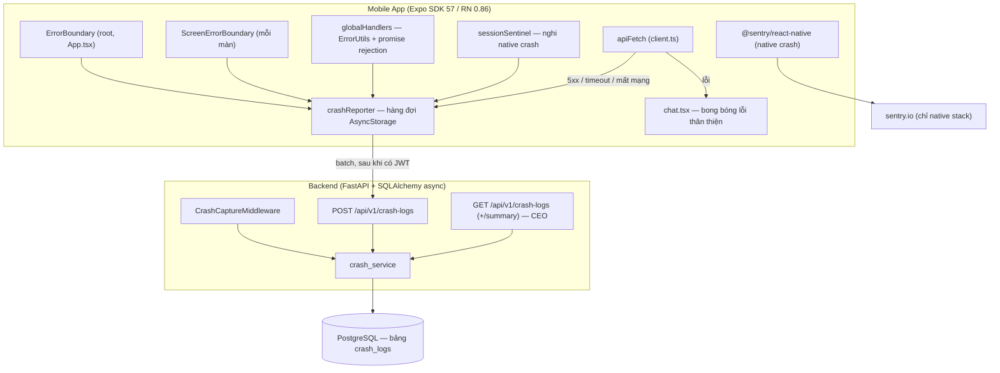
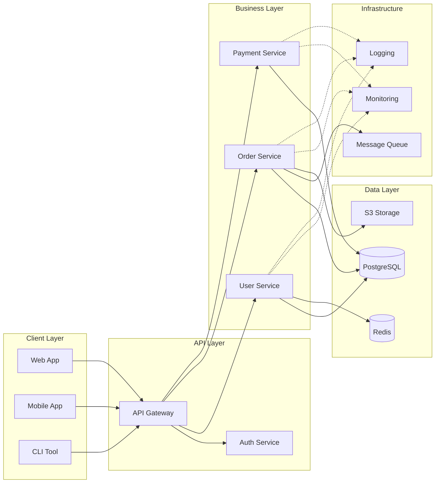
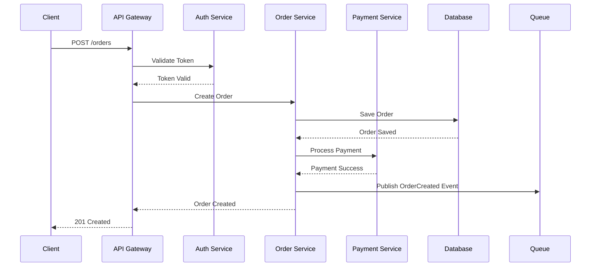
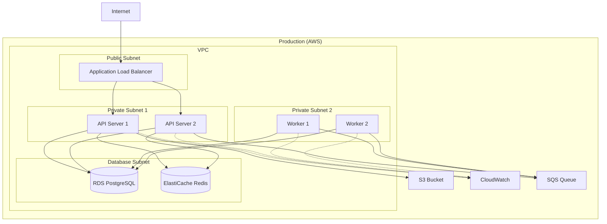

# System Architecture Diagram

**Project**: AI Assistant — Trợ lý AI Quản lý Công việc
**System**: Crash Reporting & Error Resilience (Sprint CR-1)
**Version**: 1.0
**Last Updated**: 2026-07-27
**Architect**: CTO (X Company)

> Tài liệu này CHỈ mô tả phần kiến trúc của sprint chống-crash. Kiến trúc tổng thể
> của hệ thống nằm ở `docs/superpowers/specs/2026-07-08-backend-architecture-design.md`.

---

## High-Level Architecture



**Nguyên tắc nền**: hàng đợi ở client là *fire-and-forget*. Việc gửi crash log KHÔNG BAO GIỜ
được ném lỗi ra ngoài — nếu không, chính bộ báo lỗi lại làm sập app.

---

## Layer Breakdown (Clean Architecture)

```
┌─────────────────────────────────────────┐
│     External (UI, Database, APIs)       │
│  ┌───────────────────────────────────┐  │
│  │    Interface Adapters             │  │
│  │  (Controllers, Repositories)      │  │
│  │  ┌─────────────────────────────┐  │  │
│  │  │  Use Cases                  │  │  │
│  │  │  (Business Workflows)       │  │  │
│  │  │  ┌───────────────────────┐  │  │  │
│  │  │  │  Entities             │  │  │  │
│  │  │  │  (Core Domain)        │  │  │  │
│  │  │  └───────────────────────┘  │  │  │
│  │  └─────────────────────────────┘  │  │
│  └───────────────────────────────────┘  │
└─────────────────────────────────────────┘

Dependencies: Outside → Inside
```

---

## Component Diagram



---

## Data Flow Diagram

### Example: Order Creation Flow



---

## Deployment Architecture



---

## Technology Stack

### Frontend (đã có sẵn — KHÔNG đổi)
- **Framework**: Expo SDK 57, React Native 0.86, React 19.2.3, TypeScript 6
- **Navigation**: React Navigation v7 (native-stack + drawer + bottom-tabs)
- **Storage**: `@react-native-async-storage/async-storage` 2.2.0 (hàng đợi crash), `expo-secure-store` (token)
- **Build**: `expo-dev-client` + EAS → có thể thêm native module

### Frontend (THÊM MỚI trong sprint này)
- **Crash native**: `@sentry/react-native` — bật/tắt theo biến `EXPO_PUBLIC_SENTRY_DSN`, thiếu DSN thì no-op
- **Test**: `jest-expo` + `@testing-library/react-native` + `react-test-renderer` (devDependencies)
- **Thiết bị**: `expo-device` + `expo-constants` (đã có sẵn) để lấy model/OS/app version

### Backend (đã có sẵn — KHÔNG đổi)
- **Language**: Python 3.12 / **Framework**: FastAPI 0.115
- **ORM**: SQLAlchemy 2.0 async + asyncpg / **Migration**: Alembic
- **Validation**: Pydantic v2 (`app/schemas.py`)
- **Test**: pytest + pytest-asyncio + httpx

### Database
- **Primary**: PostgreSQL (dev map host port **5435**)
- **Cache/Queue**: Redis (dev port **6380**) + arq worker
- **Bảng mới**: `crash_logs` (xem File Blueprint)

### Infrastructure
- **Deploy**: GitHub Actions → GHCR → SSH VPS (`docker compose pull + alembic upgrade + up`)
- **Giám sát crash**: `GET /api/v1/crash-logs/summary` qua Swagger + Sentry (chỉ native stack)
- **N/A**: Kubernetes, multi-AZ, CDN — dự án chạy 1 VPS, chưa cần.

---

## ⭐ File Blueprint (MANDATORY — CTO fills this)

**Every file = 1 responsibility. Every component = its own file. Dev agents follow this as their map.**
**Code quality rules (Clean Code, DRY, SOLID, Error Handling) → see `helpers/code-quality.md`**

### Structure: repo hiện hữu `backend/` + `frontend/` (KHÔNG tạo `app/` ở root)

> ⚠️ Template gốc là Next.js/Prisma. Dự án này là **FastAPI + React Native**.
> Blueprint dưới đây là bản chính thức — dev agent bám theo đúng đường dẫn này.

```
backend/
├── app/
│   ├── models.py                       # SỬA: thêm class CrashLog + enum CrashSource, CrashSeverity
│   ├── schemas.py                      # SỬA: CrashLogIn, CrashLogBatchIn, CrashLogOut,
│   │                                   #      CrashLogListOut, CrashSummaryRow (Pydantic v2)
│   ├── main.py                         # SỬA: include_router(crash_logs) + add_middleware(CrashCaptureMiddleware)
│   ├── api/
│   │   └── crash_logs.py               # MỚI: 3 route (POST batch, GET list, GET summary). Router mỏng — logic ở service.
│   ├── services/
│   │   └── crash_service.py            # MỚI: ingest_batch(), list_crashes(), summarize().
│   │                                   #      Cắt payload, tính fingerprint, dedupe, rate-limit Redis, require_ceo.
│   └── middleware/
│       └── crash_capture.py            # MỚI: bắt unhandled exception của FastAPI → ghi source=be_unhandled
│                                       #      bằng SESSION DB RIÊNG (session của request đã hỏng sau exception).
├── alembic/versions/
│   └── {hash}_crash_logs_table.py      # MỚI: tạo bảng + index (autogenerate rồi rà lại tay)
└── tests/
    ├── test_crash_logs_api.py          # MỚI: ingest, dedupe, cắt payload, rate limit, cô lập workspace
    └── test_crash_middleware.py        # MỚI: route ném lỗi → có bản ghi be_unhandled + client vẫn nhận 500 JSON

frontend/
├── src/errors/                         # MỚI — toàn bộ hạ tầng chống crash
│   ├── types.ts                        # CrashSource, CrashSeverity, CrashPayload
│   ├── crashReporter.ts                # Hàng đợi AsyncStorage + flush + dedupe theo fingerprint.
│   │                                   # MỌI hàm public bọc try/catch — không bao giờ ném ra ngoài.
│   ├── fingerprint.ts                  # Hàm thuần: (source,message,stack) → hash ổn định
│   ├── redact.ts                       # Hàm thuần: xóa token/password/authorization khỏi context
│   ├── deviceInfo.ts                   # Gom app_version/build/platform/os_version/device_model (expo-device, expo-constants)
│   ├── breadcrumbs.ts                  # Vòng đệm 20 dấu vết gần nhất (điều hướng + API)
│   ├── globalHandlers.ts               # ErrorUtils.setGlobalHandler + unhandled promise rejection
│   ├── sessionSentinel.ts              # Cờ phiên: mở app đặt cờ, vào background xóa → nghi native crash
│   ├── sentry.ts                       # initSentry(): no-op nếu thiếu EXPO_PUBLIC_SENTRY_DSN
│   ├── ErrorBoundary.tsx               # Class component gốc — fallback toàn màn + nút "Tải lại"
│   ├── ScreenErrorBoundary.tsx         # Bọc từng màn — fallback nhỏ + nút "Thử lại" (reset boundary)
│   └── index.ts                        # Public API của module errors
├── src/api/
│   ├── client.ts                       # SỬA: apiFetch báo 5xx/timeout/mất mạng vào crashReporter + breadcrumb
│   └── crashLogs.ts                    # MỚI: postCrashLogs(items) — dùng fetch TRẦN, KHÔNG qua apiFetch
│                                       #      (tránh đệ quy: lỗi khi gửi log lại sinh ra log)
├── App.tsx                             # SỬA: bọc <ErrorBoundary> ngoài cùng + initSentry + initGlobalHandlers
├── src/navigation/MainNavigator.tsx    # SỬA: bọc <ScreenErrorBoundary> quanh mỗi Stack.Screen
├── src/navigation/AuthNavigator.tsx    # SỬA: tương tự
├── src/auth/AuthContext.tsx            # SỬA: đăng nhập thành công → crashReporter.flush()
├── app/main/chat.tsx                   # SỬA: catch lỗi gửi tin → chèn bong bóng hệ thống, KHÔNG throw
├── jest.config.js                      # MỚI: preset jest-expo, transformIgnorePatterns cho RN
├── jest.setup.js                       # MỚI: mock AsyncStorage, expo-device, expo-constants, fetch
└── __tests__/
    ├── crashReporter.test.ts           # Hàng đợi, dedupe, cắt payload, flush, không-bao-giờ-ném
    ├── redact.test.ts                  # Lọc dữ liệu nhạy cảm
    ├── ErrorBoundary.test.tsx          # Con ném lỗi → hiện fallback, gọi report, không sập
    └── chat-error.test.tsx             # API 500 → hiện "Hệ thống đang có lỗi, vui lòng thử lại."
```

### Bảng `crash_logs` (nguồn sự thật cho migration + model)

| Cột | Kiểu | Ghi chú |
|-----|------|---------|
| `id` | UUID PK | |
| `workspace_id` | UUID FK workspaces, **index** | Bắt buộc theo quy ước repo; lấy từ JWT |
| `user_id` | UUID FK users, nullable=False, index | Lấy từ JWT |
| `source` | Enum | `fe_js` \| `fe_api` \| `fe_native_suspected` \| `be_unhandled` |
| `severity` | Enum | `fatal` \| `error` \| `warning` |
| `fingerprint` | String(64), **index** | Hash để gom nhóm — cột quan trọng nhất cho `/summary` |
| `message` | Text | ≤ 2 000 ký tự (server cắt) |
| `stack` | Text nullable | ≤ 20 000 |
| `component_stack` | Text nullable | React component stack (chỉ có từ ErrorBoundary) |
| `screen` | String(100) nullable | Tên route lúc crash |
| `app_version`, `build_number` | String(50) nullable | |
| `platform`, `os_version`, `device_model` | String(50/100) nullable | |
| `is_device` | Boolean nullable | Máy thật hay simulator |
| `request_method`, `request_path` | String nullable | Chỉ cho `fe_api` / `be_unhandled` |
| `response_status` | Integer nullable | |
| `request_id` | String(64) nullable | Nối FE ↔ BE |
| `context` | JSON nullable | breadcrumbs + extra, ≤ 8 KB |
| `client_event_id` | String(64) nullable | **UNIQUE cùng `workspace_id`** → chống ghi trùng khi retry |
| `occurred_at` | DateTime(tz) | Thời điểm ở client |
| `created_at` | DateTime(tz) | Thời điểm server nhận |

Index: `(workspace_id, created_at DESC)`, `(workspace_id, fingerprint)`, `(workspace_id, source)`.
**Lưu giữ**: 90 ngày (ghi trong doc; job dọn dẹp KHÔNG thuộc sprint này — xóa tay bằng SQL nếu cần).

### Import Boundary Rules

```
┌──────────────────────────────────────────────────┐
│  ALLOWED                                         │
│  app/pages    ──imports──►  features/*/index.ts   │
│  features/*   ──imports──►  shared/*              │
│  shared/*     ──imports──►  (external libs only)  │
│  e2e/         ──imports──►  (test utils only)     │
├──────────────────────────────────────────────────┤
│  FORBIDDEN                                       │
│  features/A   ──CANNOT──►   features/B            │
│  shared/*     ──CANNOT──►   features/*            │
│  features/*   ──CANNOT──►   app/pages             │
├──────────────────────────────────────────────────┤
│  CROSS-FEATURE COMMUNICATION                     │
│  → Via shared types/events in shared/             │
│  → Via parent page composition in app/            │
│  → Via shared store/context in shared/hooks/      │
└──────────────────────────────────────────────────┘
```

### Agent Ownership (PM uses this for task assignment)

| Module | Owner Agent | Trách nhiệm |
|--------|-------------|-------------|
| `backend/app/models.py`, `schemas.py`, `alembic/` | netflix-backend-architect #1 | Bảng + migration + Pydantic schema |
| `backend/app/api/crash_logs.py`, `services/crash_service.py` | netflix-backend-architect #1 | 3 endpoint + logic ingest/summary |
| `backend/app/middleware/crash_capture.py`, `main.py` | netflix-backend-architect #2 | Middleware bắt exception BE |
| `frontend/src/errors/**` | meta-react-architect #1 | Toàn bộ hạ tầng crash FE |
| `frontend/App.tsx`, `src/navigation/**`, `src/auth/AuthContext.tsx` | meta-react-architect #1 | Gắn boundary + flush sau login |
| `frontend/app/main/chat.tsx`, `src/api/client.ts`, `src/api/crashLogs.ts` | meta-react-architect #2 | Chat báo lỗi thân thiện + hook log ở apiFetch |
| `frontend/jest.config.js`, `jest.setup.js`, `__tests__/**` | google-qa-engineer | Dựng nền test + BDD scenario |
| `backend/tests/**` | google-qa-engineer | Test API + middleware |

**⚠️ Chống giẫm chân**: `backend/app/main.py` bị **cả hai** agent BE cần sửa (một thêm router,
một thêm middleware). → BE #1 sửa `main.py` (thêm cả 2 dòng theo blueprint); BE #2 KHÔNG chạm `main.py`.

### Naming Conventions

| Element | Convention | Example |
|---------|-----------|---------|
| Components | PascalCase, 1 file each | `MemberDetail.tsx` |
| Hooks | `use` + PascalCase | `useTreeLayout.ts` |
| Lib/Utils | kebab-case | `tree-layout.ts` |
| Types | PascalCase noun | `Member`, `FamilyStore` |
| Stores | `use` + noun + `Store` | `useFamilyStore.ts` |
| Unit tests | `{domain}.test.ts` | `auth.test.ts` |
| E2E tests | `{flow}.spec.ts` | `login-flow.spec.ts` |
| Constants | UPPER_SNAKE_CASE | `MAX_TREE_DEPTH` |
| Feature index | `index.ts` always | Public API of the module |

### Rules

- 1 file = 1 component, 1 hook, or 1 utility (STRICT — no multi-export grab bags)
- Every file in blueprint MUST have a `# responsibility` comment
- Max 300 lines per file — split if larger
- Features import shared, NEVER import other features
- `index.ts` = public API of each feature — internal files are private
- New file needed? CTO updates blueprint FIRST, then PM creates task
- Tests colocated with feature (`[domain].test.ts`), E2E in `e2e/`

---

## Security Architecture

```
┌─────────────────────────────────────┐
│         Security Layers             │
├─────────────────────────────────────┤
│ 1. Network: VPC, Security Groups    │
│ 2. Transport: HTTPS/TLS 1.3         │
│ 3. Auth: JWT + OAuth 2.0            │
│ 4. Authorization: RBAC              │
│ 5. Data: Encryption at rest/transit │
│ 6. Application: Input validation    │
│ 7. Monitoring: WAF, IDS/IPS         │
└─────────────────────────────────────┘
```

**Security Measures**:
- [ ] HTTPS enforced
- [ ] JWT token authentication
- [ ] Role-based access control (RBAC)
- [ ] Input validation & sanitization
- [ ] SQL injection prevention
- [ ] XSS prevention
- [ ] CSRF protection
- [ ] Rate limiting
- [ ] Secrets management (AWS Secrets Manager / Vault)
- [ ] Database encryption at rest
- [ ] Audit logging

---

## Scalability Strategy

### Horizontal Scaling
- **API Servers**: Auto-scaling based on CPU/memory
- **Workers**: Scale based on queue length
- **Database**: Read replicas for read-heavy workloads

### Caching Strategy
```
Client → CDN → API Gateway → Redis Cache → Database
         ↓        ↓              ↓            ↓
       Static   API Routes    Hot Data    Source of Truth
```

**Cache Levels**:
1. **CDN**: Static assets (images, CSS, JS)
2. **Application**: Frequently accessed data (user sessions, config)
3. **Database**: Query result cache

### Load Balancing
- **Algorithm**: Round-robin with health checks
- **Session Affinity**: Sticky sessions (if needed)
- **Health Checks**: HTTP /health endpoint every 30s

---

## Monitoring & Observability

### Metrics to Track
- **Application**: Response time, error rate, throughput
- **Infrastructure**: CPU, memory, disk, network
- **Business**: Orders/sec, revenue, user signups

### Logging Strategy
```
Application → Structured Logs → Log Aggregator → Dashboards
              (JSON format)      (CloudWatch)     (Grafana)
```

### Alerting
- **Critical**: P0 - Page immediately (5xx errors, service down)
- **Warning**: P1 - Notify team (high latency, increased errors)
- **Info**: P2 - Log only (threshold warnings)

---

## Disaster Recovery

### Backup Strategy
- **Database**: Daily backups + point-in-time recovery (PITR)
- **Object Storage**: Versioning enabled
- **Retention**: 30 days for all backups

### Recovery Objectives
- **RTO** (Recovery Time Objective): < 1 hour
- **RPO** (Recovery Point Objective): < 15 minutes

### High Availability
- **Multi-AZ Deployment**: Services across 3 availability zones
- **Database Replication**: Primary + read replicas
- **Failover**: Automatic failover for database

---

## API Design

### REST Endpoints

| Method | Endpoint | Mô tả | Quyền |
|--------|----------|-------|-------|
| POST | `/api/v1/crash-logs` | Nhận **batch** crash log từ app (tối đa 20 bản ghi/lần) | ✅ Mọi user đã đăng nhập |
| GET | `/api/v1/crash-logs` | Danh sách crash log, filter + phân trang | ✅ **CEO only** (`require_ceo`) |
| GET | `/api/v1/crash-logs/summary` | Gom nhóm theo `fingerprint`: đếm số lần, số user bị, lần cuối | ✅ **CEO only** |

**Quy ước bắt buộc của repo (CLAUDE.md) áp dụng đầy đủ:**
- `crash_logs` CÓ `workspace_id`; mọi query lọc theo `workspace_id` của actor.
- `workspace_id` + `user_id` lấy từ **JWT** (`Depends(get_current_user)`), TUYỆT ĐỐI không lấy từ body client.
- Kiểm tra quyền ở service layer qua `app.permissions.require_ceo`, không ở router/prompt.

### Request — POST /api/v1/crash-logs

```json
{
  "items": [{
    "source": "fe_js",
    "severity": "fatal",
    "message": "Cannot read property 'map' of undefined",
    "stack": "at ChatScreen (chat.tsx:412)\n...",
    "component_stack": "in ChatScreen\n in ScreenErrorBoundary",
    "screen": "Chat",
    "app_version": "1.0.0", "build_number": "42",
    "platform": "ios", "os_version": "18.2", "device_model": "iPhone 15 Pro",
    "is_device": true,
    "request_method": null, "request_path": null, "response_status": null,
    "context": { "breadcrumbs": ["nav:Today", "nav:Chat", "api:POST /chat/messages 500"] },
    "occurred_at": "2026-07-27T03:11:02Z",
    "client_event_id": "9f1c…"
  }]
}
```

**Response**: `{"accepted": 1, "duplicates": 0}` — `client_event_id` là UUID sinh ở client,
unique cùng `workspace_id` → gửi lại (retry hàng đợi) KHÔNG tạo bản ghi trùng.

### Chống lạm dụng (bắt buộc — endpoint này nhận dữ liệu do client kiểm soát)

| Rủi ro | Biện pháp |
|--------|-----------|
| Spam làm phình DB | Rate limit **60 bản ghi / user / 5 phút** (Redis counter, đã có sẵn Redis) |
| Payload khổng lồ | Cắt cứng phía server: `message` ≤ 2 000 ký tự, `stack`/`component_stack` ≤ 20 000, `context` ≤ 8 KB, `items` ≤ 20 |
| Ghi trùng khi retry | `UNIQUE (workspace_id, client_event_id)` → insert bỏ qua bản trùng |
| Rò rỉ dữ liệu nhạy cảm | Client **lọc** `Authorization`, `refresh_token`, `password` khỏi breadcrumbs/context trước khi gửi |
| Bão log lúc sự cố diện rộng | Client gộp theo `fingerprint`, tối đa 50 bản ghi tồn trong hàng đợi (FIFO, cũ nhất bị bỏ) |

---

## Performance Requirements

| Metric | Target | Current |
|--------|--------|---------|
| **API Response Time (p95)** | < 200ms | [TBD] |
| **API Response Time (p99)** | < 500ms | [TBD] |
| **Throughput** | > 1000 req/s | [TBD] |
| **Database Query Time** | < 50ms | [TBD] |
| **Uptime** | 99.9% | [TBD] |
| **Error Rate** | < 0.1% | [TBD] |

---

## Architectural Decisions

### ADR-001: Crash log tự lưu vào DB thay vì phụ thuộc hoàn toàn SaaS
- **Ngày**: 2026-07-27 — **Trạng thái**: Accepted (client quyết)
- **Bối cảnh**: Client muốn tự xem "app crash về việc gì" mà không rời khỏi hệ thống của mình.
- **Quyết định**: Bảng `crash_logs` + 3 endpoint. Sentry chỉ đảm nhiệm phần native stack.
- **Hệ quả**: ✅ Dữ liệu thuộc sở hữu client, truy vấn tự do. ❌ Phải tự lo rate-limit, cắt payload, dọn dữ liệu cũ.

### ADR-002: Endpoint crash-log BẮT BUỘC đăng nhập + hàng đợi offline
- **Ngày**: 2026-07-27 — **Trạng thái**: Accepted (client quyết, CEO đã nêu đánh đổi)
- **Bối cảnh**: Crash ở màn splash/login xảy ra khi chưa có JWT.
- **Quyết định**: Endpoint yêu cầu JWT. Client **giữ log trong AsyncStorage** và flush ngay sau khi đăng nhập thành công.
- **Hệ quả**: ✅ Không có endpoint ẩn danh để spam. ❌ Crash của người **chưa bao giờ đăng nhập được** sẽ không tới server (Sentry vẫn bắt được nhóm này).

### ADR-003: Sentry cho native crash, bật/tắt bằng biến môi trường
- **Ngày**: 2026-07-27 — **Trạng thái**: Accepted (client quyết)
- **Bối cảnh**: ErrorBoundary chỉ bắt lỗi JS; crash tầng native cần SDK native.
- **Quyết định**: `@sentry/react-native`, đọc `EXPO_PUBLIC_SENTRY_DSN`; **thiếu DSN → không khởi tạo**, app chạy bình thường.
- **Hệ quả**: ✅ Sprint không bị chặn khi chưa có tài khoản Sentry. ❌ Cần build native lại (dev-client/EAS), không chạy trên Expo Go.

### ADR-005: Lỗi BE không xác định được danh tính → ghi ra log tiến trình, KHÔNG ghi DB
- **Ngày**: 2026-07-27 — **Trạng thái**: Accepted
- **Bối cảnh**: `crash_logs.workspace_id`/`user_id` là NOT NULL + FK. Một unhandled exception ở endpoint
  chưa đăng nhập (login, refresh, health) không có danh tính để gắn. Bản hiện thực đầu tiên dùng
  **nil UUID** làm sentinel — trên SQLite (test) chèn được nên test xanh, trên Postgres FK từ chối nên
  log bị bỏ im lặng. Test xanh vì một lý do không tồn tại ở production: **xanh giả**.
- **Các phương án đã cân nhắc**:
  | Phương án | Vì sao loại/chọn |
  |---|---|
  | Cho `workspace_id` nullable | Loại. Phá quy ước repo, và mọi query đều lọc theo workspace → dòng NULL vô hình với tất cả mọi người, lưu cũng vô ích |
  | Nil UUID sentinel | Loại. Xanh giả — che mất chính nhóm lỗi cần nhìn |
  | Gán vào một workspace "hệ thống" | Loại. Thêm khái niệm mới chỉ để phục vụ log |
  | **Không ghi DB, ghi ra stderr có cấu trúc** | **Chọn** |
- **Quyết định**: Không giải mã được JWT → **không** ghi `crash_logs`. Thay vào đó ghi 1 dòng log có cấu trúc
  ra stderr (`docker logs` bắt được): `path`, `method`, `fingerprint`, traceback. Lỗi vẫn trả 500 bình thường.
- **Hệ quả**: ✅ Không có bản ghi giả, không phụ thuộc khác biệt SQLite/Postgres, giữ nguyên quy ước repo.
  ❌ Lỗi ở endpoint chưa đăng nhập không xem được qua `/summary` — phải đọc `docker logs`. Chấp nhận được:
  gần như toàn bộ endpoint của hệ thống đều yêu cầu đăng nhập, nên nhóm này rất nhỏ.
- **Ràng buộc kèm theo**: Code production **KHÔNG** được chứa nhánh `if "pytest" in sys.modules` hay tự chèn
  route test vào router. Test cần route ném lỗi thì **test tự dựng app riêng** trong fixture của mình.

### ADR-004: `crashReporter` không bao giờ được ném lỗi
- **Ngày**: 2026-07-27 — **Trạng thái**: Accepted
- **Bối cảnh**: Bộ báo lỗi mà tự lỗi thì làm sập app đúng lúc app đang yếu nhất.
- **Quyết định**: Mọi hàm public của `crashReporter` bọc `try/catch` nuốt lỗi; gửi log dùng `fetch` trần, **không** đi qua `apiFetch` (tránh đệ quy log).
- **Hệ quả**: ✅ Không có đường nào để lớp chống-crash gây crash. ❌ Lỗi của chính reporter im lặng — bù lại bằng test bắt buộc trong `crashReporter.test.ts`.

---

**Approved By**: [Name]
**Review Date**: [Date]
**Next Review**: [Date + 3 months]
