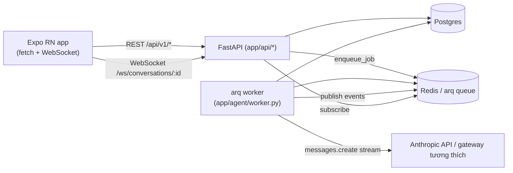

# PROJECT_CONTEXT.md

> **Last verified:** 2026-07-24
> **Branch:** phase5-session-model (chưa merge vào `main`; `main` hiện dừng ở `1e31fb0` = spec+plan Phase 5 dạng docs, chưa có code Phase 5)
> **Verified against commit:** `b47a475` (commit code cuối cùng của Phase 5, gồm cả fix nút tạo conversation thủ công phát hiện lúc verify — SHA tự tham chiếu không khả thi vì sửa nội dung đổi SHA mỗi lần, nên ghi commit code cha thay vì đuổi theo SHA của chính commit docs)

Trạng thái thực tế của code tại commit trên, xác minh trực tiếp từ source (không dựa vào spec/plan). Nếu HEAD của branch đã đi xa hơn commit này, đối chiếu lại trước khi tin — đặc biệt các bảng API/màn hình/cờ mock bên dưới.

## 1. Mục đích sản phẩm & vai trò người dùng

App mobile (Expo/React Native) chat-first: người dùng điều hành công việc chủ yếu bằng cách nhắn cho AI, AI gọi tool để thực hiện thay vì người dùng thao tác qua menu. Đa công ty (multi-tenant) — mỗi `Workspace` có 1 CEO, dữ liệu cách ly tuyệt đối theo `workspace_id`.

Ba vai trò (`app/models.py::Role`): `ceo`, `manager`, `employee`. CEO toàn quyền trong workspace; manager thấy/thao tác được task của bản thân + nhân viên dưới quyền (`manager_id`); employee chỉ thấy việc của chính mình. Chi tiết ma trận ở mục 6.

## 2. Kiến trúc & tech stack



- **Backend**: Python, FastAPI 0.115, SQLAlchemy 2.0 (async, asyncpg prod / aiosqlite test), Alembic, Pydantic-settings, PyJWT+bcrypt, `anthropic` SDK 0.119 (nâng từ 0.39 ở Phase 4 — bản cũ thiếu tham số `thinking`), `arq` (Redis-backed job queue), `openpyxl` (xuất Excel).
- **Frontend**: Expo SDK ~57, React 19.2 / React Native 0.86, **react-navigation** (Drawer + native-stack — Expo Router đã bị gỡ hẳn, không còn là dependency; `index.js` ghi rõ "đã bỏ expo-router"), không Redux/Zustand — state cục bộ bằng `useState`/`Context` (`AuthContext`).
- **Hạ tầng dev** (`backend/docker-compose.yml`): Postgres 16 (host port 5435), Redis 7 (host port 6380), service `api` (FastAPI) + `worker` (arq, chạy `app.agent.worker.WorkerSettings`) tách biệt — worker mới thực sự gọi Anthropic.
- Chat không chạy đồng bộ trong request HTTP: `POST .../messages` chỉ tạo `ChatRequest` (status `queued`) rồi `enqueue_job`; **worker** (`arq`) mới thực thi `run_agent_loop` và publish sự kiện qua Redis pub/sub; FE nhận qua WebSocket. Middleware/API không tự chạy agent loop — chạy `uvicorn` mà không có `arq worker` song song thì chat sẽ kẹt ở `queued` mãi.
- **Session model (Phase 5, `app/services/session_service.py` + `app/agent/summarizer.py`)**: mỗi user có tối đa 1 `Conversation` "sống" (`archived_at IS NULL`) — `GET /conversations/active` resolve/tạo/xoay conversation này lúc FE mount. Lịch sử dài được nén định kỳ vào `Conversation.rolling_summary` thay vì giữ verbatim mãi, và được tiêm vào **system prompt** (không phải message) mỗi lượt gọi model. Chi tiết đầy đủ ở mục 6.

## 3. Cấu trúc repo (thư mục quan trọng)

```
backend/app/
  api/            REST routers, 1 file/domain, prefix /api/v1/<domain>
  agent/          loop.py (vòng lặp agent), worker.py (arq job + cron), tools.py (tool registry),
                  llm_client.py (Anthropic wrapper), publisher.py (Redis pub/sub)
  services/       business logic (1 file/domain), tất cả permission check nằm ở đây
  models.py       toàn bộ SQLAlchemy models (28 bảng)
  schemas.py      toàn bộ Pydantic request/response models
  permissions.py  visible_user_ids / visible_task_ids / require_ceo... — nguồn chuẩn duy nhất cho quyền
  config.py       Settings (env vars) + các cờ *_mock
  security.py     JWT + bcrypt
  deps.py         get_current_user (JWT bearer)
alembic/versions/ 22 migration (xem mục 9)
backend/tests/    128 test file, pytest + pytest-asyncio, SQLite in-memory (StaticPool)

frontend/app/
  auth/           login, signup-workspace, activate (signup-code.tsx còn file nhưng đã tắt)
  main/           chat, today, tasks, settings + các màn phụ (tasks/detail, team/detail, projects, skills...)
frontend/src/
  navigation/     RootNavigator (auth gate) → MainNavigator (Drawer: Chat/Dashboard/Công việc/Cài đặt + native-stack các màn phụ)
  api/            1 file/domain, tất cả gọi qua apiFetch (src/api/client.ts)
  ui/             theme.ts (design tokens), form.tsx, BackHeader.tsx, ConversationalForm.tsx
  auth/           AuthContext (JWT access+refresh trong SecureStore/AsyncStorage)
```

## 4. Backend domains & API đã implement

Tất cả route dưới `/api/v1`. Quyền luôn kiểm tra trong service layer (`require_ceo`, `get_visible_task_or_404`...), không bao giờ ở tầng router hay prompt.

| Domain (router) | Endpoint chính | Ghi chú quyền |
|---|---|---|
| `auth` | signup-workspace, activate, login, refresh, logout, unlock-request, forgot-password, reset-password | **`signup-code` đã comment tắt** (route bỏ, `auth_service.signup_with_code` giữ nguyên) — nhân viên không còn tự đăng nhập app (2026-07-23). activate = kích hoạt tài khoản do CEO tạo sẵn (xem `invites` bên dưới); forgot/reset-password = OTP đặt lại mật khẩu |
| `users` | GET /me, GET "" (danh sách theo quyền thấy), GET /{id}/devices, POST /{id}/lock, /unlock, /offboard, /change-role | devices + lock/unlock/offboard/change-role: CEO-only |
| `invites` | POST "" (`create_employee`: CEO tạo tài khoản nhân viên/quản lý TRỰC TIẾP — email/tên/role/manager cho sẵn, `User` tạo ngay ở trạng thái `pending`, trả về `activation_code` 8 ký tự) | CEO-only; CEO tự đưa `activation_code` cho người đó (Zalo/nói trực tiếp), người đó vào FE màn hình `(auth)/activate.tsx` nhập mã + tự đặt mật khẩu (`POST /auth/activate`) — không còn bước "chấp nhận lời mời" tự đăng ký kiểu cũ (route `signup-invite` đã xóa hẳn, chưa từng có màn hình FE redeem). Cũng gọi được qua chat (agent tool `create_employee`). |
| `workspace` | GET/POST /invite-code (rotate) | CEO-only |
| `projects` | POST, GET, PATCH, **DELETE /{id}** | create/patch/delete CEO-only; list theo `visible_project_ids`. DELETE là tool nhạy cảm khi gọi qua chat (xem mục 6) |
| `tasks` | POST, GET, GET/{id}, PATCH, **DELETE /{id}**, POST/DELETE assignees, POST/GET updates, POST/GET comments | create/delete CEO-only; list/get theo `visible_task_ids`. DELETE task là tool nhạy cảm khi gọi qua chat (xem mục 6) |
| `attachments` | POST/GET tasks/{id}/attachments, GET /attachments/{id}/file | whitelist đuôi file + giới hạn 20MB, quyền qua task-visibility |
| `skills` | POST, GET, POST /{id}/versions, POST /{id}/grants, GET /{id}/use | create/version/grant CEO-only; list: CEO thấy hết, người khác chỉ thấy skill được cấp; `use` bypass `visible_task_ids` có chủ đích (xem mục 6) |
| `instructions` | POST, GET, PATCH, DELETE | toàn bộ CEO-only kể cả list |
| `notes` | POST, GET (?on_date, ?tag) | ghi chú cá nhân — chỉ tác giả thấy, không ai khác kể cả CEO |
| `voice_notes` | POST (upload), POST /{id}/transcribe, GET, GET/{id}, GET/{id}/file, DELETE /{id}, PATCH /{id} (title/tags) | STT mock (xem mục 8) |
| `emails` | GET ?box=inbox\|sent | **không có POST gửi** — gửi mail chỉ qua chat/agent tool `send_email` |
| `portal` | GET /reports, GET /reports/{id} | CEO + gói Advanced; mock (mục 8) |
| `reports` | GET "" (list), GET /{id}/download (xlsx) | CEO-only; tạo report chỉ qua agent tool `generate_report` hoặc `ReportSchedule` cron, không có POST tạo qua REST |
| `report_schedules` | POST, GET, DELETE | CEO + Advanced; cron `check_report_schedules` (arq, mỗi phút) tự sinh report tới hạn |
| `notifications` | GET (?unread_only), GET /preferences, PATCH /preferences, POST /{id}/read, POST /read-all | mỗi user chỉ thấy thông báo của chính mình; preferences = bật/tắt theo từng loại thông báo |
| `directives` (Phase 3) | POST "" (tạo), GET "" (list theo phạm vi actor), POST /{id}/ack, /question, /renegotiate | tạo: CEO hoặc manager cho direct report (`can_assign_directive`, KHÁC `require_ceo`); ack/question/renegotiate: chỉ recipient (404 nếu không phải) |
| `audit` | GET /audit-events (?date_from, ?date_to) | CEO-only, gộp 5 nguồn (task update, login, khóa/mở, đổi instruction/skill, account event) |
| `traces` (admin) | GET /admin/traces/{chat_request_id} | CEO-only; xem `AgentTrace` của 1 request (observability/debug agent) |
| `search` | GET ?q= | gộp task/note/voice_note/user/skill, tôn trọng quyền từng loại |
| `dashboard` | GET /today | task quá hạn/đến hạn/đang làm + cập nhật 24h + note hôm nay, theo phạm vi quyền actor |
| `subscription` | GET, PATCH | PATCH = CEO-only, mock chuyển Basic/Advanced không có thanh toán thật |
| `devices` | PUT /push-token | tự đăng ký device hiện tại, không cần CEO |
| `chat` (`conversations`, `chat-requests`) | POST/GET/PATCH/**DELETE** conversations, **GET /active** (Phase 5), **GET /timeline** (Phase 5), POST/GET messages, GET requests, POST stop-all, POST/PATCH/POST(cancel/confirm/reorder) chat-requests | DELETE conversation xóa cascade thủ công; `GET /active` = resolve/tạo/xoay conversation "sống" của actor (`session_service`, gọi lúc FE mount); `GET /timeline` = message xuyên **mọi** conversation của actor (không chỉ 1 conversation), newest-first, cursor `(before_at, before_id)` — đã review riêng nguy cơ rò rỉ cross-user/cross-workspace, xác nhận an toàn (lọc `workspace_id`+`user_id`); chi tiết mục 6 |
| `ws` | WebSocket `/ws/conversations/{id}?token=` | stream token/status realtime qua Redis pub/sub |

## 5. Frontend: màn hình & navigation đã implement

Điều hướng bằng **react-navigation** (KHÔNG Expo Router): `MainDrawer` (mặc định mở màn Chat) có **4 mục chính** — Chat, Dashboard (`today`), Công việc (`tasks`), Cài đặt (`settings`); drawer content liệt kê danh sách conversation "Gần đây" + link "Xem tất cả" sang màn Conversations. **Phase 5: KHÔNG còn nút "New chat" ở đâu trong FE** (bỏ khỏi `DrawerContent.tsx` + `main/conversations.tsx` + `chat.tsx` header — xem chi tiết ở dòng `main/chat.tsx`/`main/conversations.tsx` bên dưới). Các màn còn lại push chồng qua `MainNavigator` (native-stack), mỗi màn tự render `<BackHeader/>`.

| Route (file) | Vai trò truy cập | Ghi chú |
|---|---|---|
| `main/chat.tsx` (drawer) | mọi role | **Phase 5**: mở KHÔNG có `?id=` (mặc định vào drawer) luôn resolve conversation "sống" thật qua `getActiveConversation()` + nạp `getTimeline()` (xuyên MỌI conversation của user, không chỉ 1 row — sau khi server xoay ngầm, người dùng vẫn thấy 1 luồng liền mạch qua phân trang `loadOlder()`, không "mất lịch sử"). Mở có `?id=` cụ thể (từ "Gần đây" hoặc màn Conversations) vào **history mode**: nếu conversation đó `archived_at != null` thì composer bị thay bằng thanh "chỉ xem — chạm để về luồng hiện tại" và `submit`/`resumeQueue` no-op; nếu CHƯA archived (vd đang xem chính conversation sống qua id, hoặc 1 conversation live khác — xem mục 11) thì vẫn gõ/gửi bình thường, không bị khóa. Streaming qua WebSocket, hàng đợi, dừng/hủy/ưu tiên, xác nhận hành động nhạy cảm + proposal, hold-queue khi mất mạng; đọc chính tả + đính kèm/phát ghi âm |
| `main/today.tsx` (drawer, "Dashboard") | mọi role | counters, ghi âm nhanh (QuickVoiceCard), quá hạn/đến hạn/đang làm, cập nhật 24h, ghi chú; link sang Notifications + Notes |
| `main/tasks.tsx` (drawer, "Công việc") | mọi role | duyệt/lọc: Của tôi/Tôi quản lý/Quá hạn/Bị chặn/Đã hoàn thành; chỉ đọc — tạo/sửa vẫn qua chat |
| `main/settings.tsx` (drawer) | mọi role | entry point tới hầu hết route CEO-only bên dưới |
| `main/conversations.tsx` | mọi role | tìm/đổi tên/xóa conversation (vuốt để sửa tên/xóa); mở 1 dòng → `chat.tsx` ở history mode (xem trên). Nút "+ Cuộc trò chuyện mới" (gọi thẳng `POST /conversations`, không qua `get_or_rotate_active_conversation`) đã bỏ hẳn (phát hiện lúc verify Task 12, fix ở commit `b47a475`, cùng đợt với task 10/11) — màn này giờ thuần túy lịch sử (đọc/đổi tên/xóa), không còn đường tạo conversation nào ở FE |
| `main/projects.tsx` | mọi role (theo `visible_project_ids`) | đọc, expand xem task trong project |
| `main/tasks/detail.tsx` | theo quyền task | chi tiết, đính kèm, thảo luận (bình luận), xóa task |
| `main/team.tsx` / `main/team/detail.tsx` | CEO-only | danh sách/chi tiết nhân sự, khóa/mở, nghỉ việc, đổi vai trò, log thiết bị |
| `main/notes.tsx` | mọi role | ghi chú cá nhân |
| `main/instructions.tsx` | CEO-only | quản lý chỉ dẫn AI |
| `main/skills.tsx` | mọi role (CEO thêm quyền tạo/version/cấp quyền) | |
| `main/voice-notes.tsx` | mọi role | thư viện ghi âm (sửa tiêu đề/tags/xóa) |
| `main/emails.tsx` | mọi role | chỉ đọc |
| `main/portal.tsx` | CEO + Advanced | |
| `main/notifications.tsx` | mọi role | list + preferences bật/tắt từng loại; riêng `directive_assigned` có 3 nút hành động tại chỗ (Nhận việc/Hỏi lại/Xin dời hạn) |
| `main/reports.tsx` | CEO-only | tải + chia sẻ file Excel |
| `main/report-schedules.tsx` | CEO + Advanced | |
| `main/audit-log.tsx` | CEO-only | |
| `main/search.tsx` | — | **CODE MỒ CÔI**: file màn + `src/api/search.ts` + endpoint BE đều có, nhưng KHÔNG navigator nào trỏ tới (không thể mở từ UI). Cần quyết bỏ hẳn hay nối lại |

Màn auth (`app/auth/`): login, forgot-password, signup-workspace, activate — 3 màn cuối dùng `ConversationalForm` (hỏi từng câu kiểu chat). `signup-code.tsx` còn file nhưng route đã tắt.

FE **không có** màn hình tạo/sửa Project hay Task (đúng chủ đích sản phẩm — hành động quản trị qua chat).

## 6. AI agent: loop, tool, hàng đợi, streaming, xác nhận

- **Model**: `get_llm_client(model=None, thinking_budget=None)` (`@lru_cache`, keyed theo tham số) — gọi không tham số = singleton `model_fast` (mặc định `"claude-haiku-4-5"`, path thường/ack); gọi `get_llm_client(settings.model_smart, budget)` = singleton THỨ 2 riêng cho đường sâu (`model_smart`, mặc định `"claude-sonnet-4-6"`, + extended thinking). Không hardcode model ID trong code nghiệp vụ. `anthropic_base_url` rỗng = gọi thẳng `api.anthropic.com`; set giá trị khác để qua gateway tương thích Anthropic API.
- **Router (Phase 4 §8.1, `app/agent/router.py`)**: phân loại ý định câu nói MỘT LẦN lúc `process_conversation` pickup request `queued` đầu tiên (không đánh giá lại giữa các vòng gọi tool). Tier 1 `classify_heuristic` — regex tiếng Việt đã bỏ dấu (0ms, không gọi model), phủ 7 nhóm (`work`/`insight`/`admin`/`reporting`/`skill`/`personal`/`deep`). Không khớp → tier 2 `classify_route` gọi 1 lượt `model_fast` ép ra đúng 1 từ. Cả 2 tầng không chắc → `None` → `tool_names_for_route(None)` trả `None` = **fallback nạp full 58 tool** (an toàn hơn thiếu tool, không tự đoán). `tool_names_for_route(group)` = `TOOL_GROUPS["core"] | TOOL_GROUPS[group]`, lọc vào `_tool_specs_for_api()` trước khi gọi model — Haiku không còn phải nạp cả 58 tool mỗi lượt.
- **Đường sâu (Phase 4 §8.2)**: route=`"deep"` (câu phân tích/đánh giá/so sánh nặng, vd "đánh giá rủi ro toàn bộ dự án") không chạy `run_agent_loop` thường mà: (1) `run_deep_ack_turn` — gọi `model_fast` KHÔNG tool, sinh 1-2 câu ack ("đang phân tích, ~30s..."), ghi `AgentTrace(route="deep", stop_reason="ack_sent")`, chuyển `ChatRequest.status` `queued→running→deep_running` (state MỚI, KHÔNG phải `done` — hàng đợi tiếp tục xử lý tin nhắn sau, không bị chặn), publish `deep_analysis_started` (KHÔNG phải `request_done`); Message ack này đánh dấu **`is_ack=True`** và bị `_load_history` loại hẳn khỏi lịch sử gửi lại model (kể cả khi `run_deep_analysis` xử lý lại CHÍNH request này) — thiếu cờ này lịch sử sẽ có 1 message assistant "lạc chỗ" phá luật user/assistant xen kẽ bắt buộc của Anthropic, bị model từ chối thẳng (phát hiện qua verify tay end-to-end thật, xem mục 13); (2) `process_conversation` tự enqueue job arq riêng `run_deep_analysis` (`_job_id=f"deep:{request_id}"`, đăng ký `arq.worker.func(timeout=900)` — timeout riêng cao hơn `job_timeout=600` global) — job này dùng client `model_smart`+thinking (`ctx["llm_client_smart"]`), toolset `core+insight`, trần riêng `DEEP_MAX_ITERATIONS=40`/`DEEP_MAX_DURATION_SECONDS=800` (cao hơn hẳn fast path, xem bên dưới), guard chỉ chạy nếu request VẪN `deep_running` (tránh reset nhầm nếu đã bị hủy/xử lý xong bởi luồng khác). Job xong thật (`done`) → `notify(type="deep_analysis_done")` báo người gửi qua push (người dùng không ngồi chờ 30s-800s). `AgentTrace` của 1 request đường sâu có ≥2 dòng (ack + job) — mọi chỗ đọc "route của request" phải lấy dòng **cuối cùng theo `created_at`**, không phải dòng đầu (xem `evals/run_evals.py::_read_traces`).
- **Extended thinking** (model_smart): `AnthropicLLMClient` khi có `thinking_budget` thì set `max_tokens = thinking_budget + 4096` + truyền `thinking={"type":"enabled","budget_tokens":...}`; SSE accumulator gom `thinking`/`signature` delta vào `StreamDone.thinking_blocks`; `run_agent_loop` chèn nguyên văn thinking block (kèm signature) TRƯỚC text/tool_use khi dựng lại `assistant_content` cho lượt sau — bắt buộc theo hợp đồng thinking+tool-use của Anthropic.
- **Hàng đợi**: mỗi tin nhắn → 1 `ChatRequest` (`queued`), `enqueue_conversation` gửi job arq `process_conversation` với `_job_id=f"conv:{id}"` (dedup theo conversation). Worker xử lý **tuần tự từng request theo `queue_position`** cho tới khi rỗng hàng đợi của conversation đó (trừ request route="deep" — job phân tích chạy NỀN, không chặn các request `queued` tiếp theo).
- **Streaming**: `AnthropicLLMClient.stream()` đọc raw SSE event, tự accumulate theo `message_start` mới nhất (không dùng helper `messages.stream()` — có bug thực tế với gateway beeknoee). Mỗi `text_delta` publish `{"type":"token",...}` qua Redis, FE nhận qua WebSocket `/ws/conversations/{id}`.
- **Vòng lặp** (`run_agent_loop`, `app/agent/loop.py`): mỗi lượt build lại system prompt (nạp `Instruction` mới nhất từ DB — CEO sửa là AI dùng ngay, không cache/restart), gọi model, nếu `stop_reason == tool_use` thì gọi tool tương ứng (`call_tool`) và lưu `tool_result` vào lịch sử, lặp lại. Guardrail (hardening trước Phase 3, kiểm tra đầu mỗi vòng lặp) mặc định: **`MAX_ITERATIONS = 25`**, **`MAX_TOOL_CALLS = 60`**, **`MAX_DURATION_SECONDS = 240`** (< arq `job_timeout` mặc định 600s để dừng sạch trước khi bị kill), **`MAX_TOTAL_TOKENS = 200_000`** — vượt bất kỳ ngưỡng nào thì `_mark_failed` với error code riêng (`max_tool_calls_exceeded`/`max_duration_exceeded`/`max_total_tokens_exceeded`), FE có message thân thiện tương ứng. Cả 4 ngưỡng nhận kwarg override (`max_iterations=`..., đọc hằng số module BÊN TRONG hàm chứ không bind lúc định nghĩa — monkeypatch test vẫn hiệu lực) — job đường sâu (`run_deep_analysis`, Phase 4) truyền trần cao hơn hẳn (`DEEP_MAX_ITERATIONS=40`/`DEEP_MAX_DURATION_SECONDS=800`, worker.py) vì model_smart+thinking chạy nhiều vòng/tốn token hơn Haiku.
- **Xác nhận hành động nhạy cảm**: 8 tool đánh dấu `sensitive=True` — `delete_task`, `delete_project`, `lock_user`, `unlock_user`, `offboard_user`, `change_user_role`, `send_email`, `delete_instruction` (`SENSITIVE_TOOLS` được suy ra tự động từ `spec.sensitive`). Khi model gọi 1 trong các tool này, loop dừng ở `awaiting_confirmation`, publish `confirmation_required`, FE hiện nút Đồng ý/Từ chối; `POST /chat-requests/{id}/confirm` mới thực thi tool thật. Tool chạy trong `resolve_confirmation()` (kể cả nhiều action của 1 `propose_actions` đã duyệt) được ghi 1 dòng `AgentTrace` riêng (`route="confirm"`) — trước đây bị bỏ sót (backlog Phase 0), khiến hành động đã duyệt vô hình với observability.
- **Proposal nhiều action (Phase 2 `propose_actions`) báo rõ kết quả từng phần**: `_resolve_proposal()` trả `outcome` (`completed`/`partially_completed`/`failed`) + `succeeded`/`failed` (danh sách `display_text`) trong tool_result — system prompt bắt buộc model liệt kê rõ việc nào xong/lỗi khi `outcome != completed`, không được nói chung chung "đã xong".
- **Dừng/hủy**: `POST stop-all` set các request `queued` → `cancelled`, request `running` **hoặc `deep_running`** (Phase 4 — job đường sâu đang chạy nền) được đánh dấu qua Redis key `cancel:{id}` (loop tự kiểm tra `is_cancelled` giữa các bước); `POST /chat-requests/{id}/cancel` tương tự cho 1 request lẻ.
- **Mất mạng / "tiếp tục công việc"**: socket cuối cùng đóng → `continuity.hold_queue_if_pending` set `Conversation.queue_held=True`, worker thấy cờ này thì **không tự chạy tiếp**; chỉ khi user gửi đúng cụm `RESUME_PHRASE` ("tiếp tục công việc") thì `send_message` clear cờ và enqueue lại.
- **Tool registry**: `app/agent/tools.py`, **58 tool** đăng ký qua `_register(name, description, input_model, handler, sensitive=)`, bao phủ hầu hết domain ở mục 4 (project/task/comment/skill/instruction/user quản trị/report/report-schedule/audit/email/portal/note/voice/attachment/search/dashboard/notification) + 3 tool Phase 2 (`resolve_person`, `resolve_task`, `propose_actions`) + 2 tool Phase 3 (`create_directive`, `get_directive_status`) + 2 tool phân tích (`get_project_health` — soi sâu 1 project: blocked/overdue/stale + risk heuristic; `get_progress_stats` — so sánh tuần/tháng này với kỳ trước, cả 2 đọc-only, `app/services/analytics_service.py`). Quyền kiểm tra lại **trong chính service layer** khi tool gọi xuống — tool không tự ý bỏ qua permission. `TOOL_GROUPS` (Phase 2 §6.4) phân loại 58 tool này thành 7 nhóm — **đã wiring** vào Router động (Phase 4, xem trên): fast path lọc theo nhóm phân loại được, đường sâu luôn dùng cố định `core+insight`.
- **Directive (Phase 3)**: `app/models.py::Directive`/`DirectiveStatus` (state machine sent→acked/question/renegotiate, mirror `ChatRequestStatus`), `app/services/directive_service.py`, REST `app/api/directives.py`, quyền `permissions.py::can_assign_directive` (CEO → ai cũng được; manager → chỉ direct report — logic MỚI, tách biệt hoàn toàn khỏi `work_service`'s `require_ceo`). `create_directive` KHÔNG `sensitive=True` (bắt buộc để lồng được trong `propose_actions` cùng `update_task`). Email V1 vẫn qua `email_service.send_email` nội bộ (mock) — chưa có provider thật/public ack-link không cần login (xem `evals/BASELINE.md` Phase 3 lý do chi tiết).
- **Luật hành xử 3 mức (Phase 2, system prompt tĩnh)**: (1) tường minh + đảo ngược được → gọi tool ngay; (2) phải SUY LUẬN đối tượng (đoán người/task/deadline) → gọi `propose_actions` để user duyệt bản nháp trước khi thực thi (dùng lại hạ tầng `awaiting_confirmation`, `pending_action.kind` phân biệt `"tool"` | `"proposal"`); (3) nhạy cảm → vẫn gọi 1 trong 6 tool sensitive trực tiếp như cũ. `resolve_person`/`resolve_task` tra cứu mờ (fuzzy, thuần Python — không dùng `pg_trgm` vì test suite chạy SQLite) trong phạm vi `visible_user_ids`/`visible_task_ids`; trả `ambiguous` kèm candidates khi >1 kết quả — AI PHẢI hỏi lại đúng 1 câu, không tự chọn.
- **Rolling summary / nén lịch sử (Phase 5, `app/agent/summarizer.py`)**: `maybe_compress_history(db, conv, llm, *, force=False, keep_recent=SUMMARY_KEEP_RECENT) -> bool` — khi số message "sống" của 1 conversation (không tính `is_ack`, không tính message rỗng) vượt `SUMMARY_TRIGGER=60` (hoặc gọi `force=True`), gấp phần cũ (giữ lại `SUMMARY_KEEP_RECENT=40` message gần nhất) thành văn xuôi qua **1 lượt gọi `model_fast` không tool**, ghi vào `Conversation.rolling_summary` + đẩy `summary_through_at` tới điểm cắt an toàn (không bao giờ để phần giữ lại bắt đầu bằng 1 `tool_result` mồ côi). `process_conversation` (worker) gọi hàm này TRƯỚC khi dispatch mỗi request — lỗi nén được bọc try/except + `db.refresh(req)` sau `rollback()` để không giết job (bug thật tìm thấy lúc code review: `db.rollback()` trần làm expire cả `req`, dòng sau đọc `req.content` ném `MissingGreenlet` không bắt). `_load_history(..., since=conv.summary_through_at)` (`app/agent/loop.py`) chỉ nạp message có `created_at > since` — phần đã nén không gửi lại model dạng verbatim nữa. Khi `conv.rolling_summary` khác rỗng, `run_agent_loop` nối `"# Tóm tắt hội thoại trước đó\n" + rolling_summary` vào **system prompt** (block động, KHÔNG BAO GIỜ thành 1 chat message) — giữ đúng luật xen kẽ user/assistant bắt buộc của Anthropic, cùng bài học đã sinh ra `Message.is_ack` ở Phase 4.
- **Xoay conversation ngầm (Phase 5, `app/services/session_service.py`)**: bất biến — mỗi user có **≤1 `Conversation` "sống"** (`archived_at IS NULL`). `get_or_rotate_active_conversation(db, actor, llm_factory, *, now=None)` (gọi từ `GET /conversations/active` lúc FE mount): chưa có conversation nào → tạo mới; có rồi → xoay (fold TOÀN BỘ đuôi còn lại vào `rolling_summary` của conversation cũ qua `maybe_compress_history(..., force=True, keep_recent=0)`, set `archived_at`, tạo conversation mới seed sẵn `rolling_summary` đó) khi idle > `ROTATE_IDLE_HOURS=12` giờ HOẶC > `ROTATE_MAX_MESSAGES=150` message sống — TRỪ KHI còn việc dang dở (bất kỳ `ChatRequest` `queued`/`running`/`deep_running`/`awaiting_confirmation`, hoặc `queue_held=True`) thì hoãn xoay. `queue`/`queue_held`/"tiếp tục công việc" (`continuity.py`) KHÔNG bị sửa gì — rotation chỉ ĐỌC các trạng thái đó để quyết định hoãn. FE (mục 5) đọc liên tục qua `GET /conversations/timeline` xuyên nhiều conversation nên việc xoay ở tầng server trong suốt với người dùng bình thường. **Bất biến "≤1 live/user" chỉ được đảm bảo qua đúng đường `get_or_rotate_active_conversation`** — route REST `POST /conversations` (`create_conversation`) vẫn còn ở BE (tạo thẳng 1 `Conversation` mới KHÔNG qua hàm này, không có DB constraint nào chặn 2 hàng `archived_at IS NULL` cùng 1 user), nhưng FE không còn nơi nào gọi nó nữa: nút cuối cùng gọi route này (`main/conversations.tsx`, phát hiện lúc verify Task 12) đã bỏ ở commit `b47a475`, cùng đợt với việc bỏ nút ở `chat.tsx` header (task 10) và `DrawerContent.tsx` (task 11) — xem mục 5.
- **Report định kỳ**: `arq.cron` chạy `check_report_schedules` mỗi phút (không qua LLM), độc lập với vòng lặp chat.

## 7. Phân quyền & cách ly đa công ty

Nguồn chuẩn duy nhất: `app/permissions.py`.

- Mọi bảng trừ `workspaces` có cột `workspace_id`; mọi query lọc theo `actor.workspace_id` — xác nhận qua review, không có ngoại lệ nào lọt lưới trong nhánh này.
- `visible_user_ids`: CEO → cả workspace; manager → chính mình + `manager_id == actor.id`; employee → chỉ chính mình.
- `visible_task_ids`: CEO → toàn bộ; manager → task giao cho mình/nhân viên dưới quyền **+ task thuộc project mà mình là `owner_id`**; employee → task giao cho mình.
- `get_visible_task_or_404`: 404 (không phải 403) khi ngoài phạm vi — không lộ sự tồn tại của task.
- **Ngoại lệ có chủ đích**: `GET /skills/{id}/use` cấp quyền đọc `task_state` sống cho bất kỳ user nào được **grant skill**, kể cả khi task đó không nằm trong `visible_task_ids` thông thường của họ (thiết kế Plan 2: skill = ủy quyền xem state qua kênh riêng, không phải lỗ hổng). Vì kênh skill có phạm vi quyền **rộng hơn** route `/tasks/{id}` thông thường (vốn dùng `get_visible_task_or_404`, chặt hơn), FE không được giả định 2 kênh này tương đương — không tự thêm điều hướng/liên kết chéo từ dữ liệu đọc qua skill sang các route dùng permission chặt hơn nếu chưa kiểm tra người dùng thực sự có quyền ở route đích.
- Actor luôn lấy từ JWT (`get_current_user`, payload `sub`/`ws`/`role`) — không bao giờ từ tham số client hay model.

## 8. Tích hợp thật vs mock

Cờ trong `app/config.py`, tất cả **mặc định `True` (mock)** — bật thật chỉ cần set cờ tương ứng `false` + cấu hình provider, TRỪ 2 trường hợp ghi rõ "chưa có code thật" bên dưới (những trường hợp đó cần viết thêm implementation, không chỉ đổi cờ).

| Tích hợp | Cờ | Trạng thái |
|---|---|---|
| LLM (Anthropic) | — (không có cờ mock) | **Thật** — gọi `anthropic.AsyncAnthropic` thật, cần `ANTHROPIC_API_KEY`. Phần duy nhất bắt buộc phải thật để chat có nghĩa. |
| Push notification | `push_mock` | **Mặc định mock**, nhưng đã có implementation thật (`ExpoPushClient`, gọi Expo Push API) — chỉ cần set `push_mock=false`. FE đã đăng ký `push_token` khi login (`registerPushTokenBestEffort`); gửi thật qua Expo chưa được verify end-to-end trong phiên này. |
| Cổng CEO (ceo.9learning.edu.vn) | `portal_mock` | **Mặc định mock** (`MockPortalClient` trả 2 report giả lập cứng), nhưng đã có implementation thật (`HttpPortalClient`, gọi `portal_base_url`) — chỉ cần set `portal_mock=false`. Chưa xác minh với API thật vì cổng chưa công bố spec chính thức. |
| Gửi email | `email_mock` | **Mặc định mock** (`MockEmailClient` chỉ ghi `EmailMessage` vào DB). **Chưa có implementation thật** — `get_email_client()` raise `NotImplementedError` khi tắt mock; cần chọn OAuth send-as hay SMTP rồi viết code trước khi dùng được. |
| Speech-to-text (voice note) | `stt_mock` | **Mặc định mock** (trả `transcript=""`, `language="und"`). **Chưa có implementation thật** — `get_transcription_client()` raise `NotImplementedError` khi tắt mock; cần chọn provider rồi viết code. |
| Subscription/thanh toán | không có cờ — không có tích hợp | Hoàn toàn mock: `PATCH /subscription` chỉ đổi cột `plan`, không có Stripe/VNPay/... nào. Chỉ dùng để enforce giới hạn tính năng theo gói (`app/plans.py`). |

## 9. Database & migrations

Postgres (prod/dev qua docker-compose) / SQLite in-memory (test, `StaticPool`). Alembic, **22 migration** theo thứ tự: `initial_schema` → `work_domain_skills` → `chat_agent_core` → `reports` → `plan5_new_features` → `plan7_push_email_voice` → `plan8_queue_held` → `plan9_report_schedules` → `attachments_table` → `account_events_table` → `user_notification_prefs` → `email_task_project_context` → `task_deadline_reminder` → `voice_note_status_duration` → `chat_voice_attachment` → `agent_traces` → `usage_log_hardening_fields` → `directives_table` → `invite_user_id_and_pending_status` → `chat_request_deep_running_status` → `message_is_ack_flag` → **`session_model_rolling_summary`** (Phase 0 tracing + hardening + Phase 3 Directive + Phase 4 Router + Phase 5 session model — `invite_user_id_and_pending_status` thêm `UserStatus 'pending'` + `invites.user_id` FK cho activation code; `chat_request_deep_running_status` = `ALTER TYPE chatrequeststatus ADD VALUE IF NOT EXISTS 'deep_running'`; `message_is_ack_flag` thêm `messages.is_ack`; **`session_model_rolling_summary`** (Phase 5, down_revision = `message_is_ack_flag`) thêm 3 cột cho `conversations`: `rolling_summary TEXT NOT NULL DEFAULT ''`, `summary_through_at TIMESTAMPTZ NULL`, `archived_at TIMESTAMPTZ NULL` — cả migration Phase 4 lẫn Phase 5 đã chạy `alembic upgrade head` sạch trên Postgres dev thật, không chỉ SQLite). Chạy `alembic upgrade head`; `alembic` ưu tiên env `DATABASE_URL` nếu set.

28 bảng — mỗi domain ở mục 4 tương ứng 1-3 bảng (xem `app/models.py` để biết chi tiết cột, không lặp lại ở đây).

## 10. Test & lệnh verify

Chạy trong `backend/` (venv `.venv`):
```
docker compose up -d postgres redis         # 5435/6380
alembic upgrade head
pytest tests/ -v                            # 695 pass + 4 skip (128 file test) hiện tại trên nhánh này
uvicorn app.main:app --reload               # API — KHÔNG tự chạy agent loop
arq app.agent.worker.WorkerSettings         # bắt buộc chạy riêng để chat hoạt động
python scripts/export_openapi.py            # chạy lại sau MỌI thay đổi contract (schemas.py/router)
```
Frontend (`frontend/`): **không có test suite tự động** — xác minh duy nhất là `npx tsc --noEmit` (bắt buộc 0 lỗi trước khi coi là xong). Chạy thật qua `expo start` cần xác minh tay trên thiết bị/simulator — chưa có ai verify UI bằng cách này trong phiên làm việc tạo ra các màn hình mới nhất.

## 11. Hạn chế đã biết, API còn thiếu, việc còn lại

**Còn thiếu / chưa làm** (không phải "sẽ làm" — liệt kê thực tế, không suy đoán ưu tiên):
- Xóa Project/Task: ĐÃ CÓ `DELETE /projects/{id}` và `DELETE /tasks/{id}` (CEO-only; qua chat là tool nhạy cảm `delete_project`/`delete_task` cần confirm).
- ~~Không có UI chọn loại thông báo muốn nhận~~ — ĐÃ CÓ: `GET/PATCH /notifications/preferences` + `PreferencesSection` trong `main/notifications.tsx` cho bật/tắt từng loại.
- Skill: chỉ có "cấp quyền xem/dùng" (grant), không có phân biệt view/edit/use ở mức chi tiết hơn.
- **Màn Tìm kiếm mồ côi**: BE có `GET /api/v1/search`, FE có `app/main/search.tsx` + `src/api/search.ts`, nhưng KHÔNG navigator nào đăng ký route này → người dùng không mở được từ UI. Còn treo: bỏ hẳn hay nối vào Drawer/Settings.
- Không có API sửa/xóa comment hoặc note (chỉ thêm mới + liệt kê — cố ý theo tiền lệ, không phải thiếu sót).
- Chưa xác minh UI thật của 4 tab/màn hình mới nhất (Conversations, Tasks/Projects, Notification Center, Report Center) qua Expo dev server — chỉ mới qua `tsc` + review code.
- Email và STT chưa có implementation thật (chỉ mock, xem mục 8) — cần viết code provider trước khi dùng được, không chỉ đổi cờ.
- Push và Portal đã có implementation thật trong code nhưng đang chạy ở chế độ mock theo cờ mặc định (xem mục 8) — bật thật chỉ cần đổi cờ + (với Portal) có spec API thật của cổng.
- Route REST `POST /conversations` (`create_conversation`) vẫn còn ở BE (không có DB constraint chặn 2 `Conversation` cùng `archived_at IS NULL` cho 1 user) — không phải lỗ hổng đang bị khai thác vì FE không còn nơi nào gọi nó (xem mục 5/6), nhưng nếu sau này thêm 1 đường FE/tool mới gọi thẳng route này thì sẽ phá bất biến "≤1 live/user" của `get_or_rotate_active_conversation` — cân nhắc chặn ở service layer hoặc DB constraint nếu thấy cần chắc chắn hơn.

**Không phải thiếu — cố ý** (đừng nhầm là gap): tạo/sửa Project/Task chỉ qua chat (không có form CRUD ở FE); gửi email chỉ qua chat; report chỉ tạo qua chat hoặc lịch tự động.

## 12. File nên đọc trước khi sửa

- `CLAUDE.md` (repo root) — quy ước bất di bất dịch: workspace_id, quyền ở service layer, actor từ JWT, model từ config, TDD, export_openapi sau khi đổi contract.
- `frontend/AGENTS.md` + `frontend/DESIGN.md` — bắt buộc đọc trước khi sửa bất kỳ screen nào (design tokens, không hardcode màu/spacing).
- `funtional-plan.md` — spec sản phẩm gốc; đối chiếu với code thực tế trước khi tin, vài chỗ đã lệch (vd flow invite).
- `app/permissions.py`, `app/agent/tools.py`, `app/agent/loop.py` — 3 file quyết định "ai làm được gì" và "AI làm được gì qua chat".
- `frontend/src/api/client.ts` — mọi lỗi API đều đi qua `ApiError{status, detail}`, xử lý theo pattern đã có trong các screen hiện tại thay vì viết lại.
- `docs/superpowers/specs/` và `docs/superpowers/plans/` — lịch sử thiết kế từng tính năng (tham khảo bối cảnh, không phải nguồn sự thật cho trạng thái hiện tại).

## 13. Tiến độ

- 2026-07-20: Phase 0 AI upgrade xong — bảng agent_traces + GET /api/v1/admin/traces/{id},
  eval harness (backend/evals/, baseline 13/14 pass trên glm-4.7-flash, 1 fail trùng-tên là thước đo cho Phase 2),
  incremental prompt caching (verify tầng payload; gateway beeknoee không passthrough cache),
  config model_fast/model_smart. Spec: docs/superpowers/specs/2026-07-19-ai-intelligence-upgrade.md
- 2026-07-22: Phase 1 AI upgrade xong — workspace snapshot (snapshot_service: SQL aggregates +
  cache Redis TTL + cắt theo quyền, tiêm system prompt 2 block tĩnh/động, invalidate sau
  write-tool); eval 11/17 (bank giờ 18 scenario, +3 snapshot). Đã điều tra kỹ: chênh lệch so
  Phase 0 là flakiness model dev (glm-4.7-flash) đã xác minh qua chạy lại cô lập, KHÔNG phải
  regression hạ tầng — snapshot render đúng/đầy đủ khi verify trực tiếp. Latency p50 đo cô lập
  16s, KHÔNG đạt acceptance <4s trên gateway dev hiện tại (nghẽn ở gateway/model dev, không
  phải chi phí tính snapshot — cần đo lại với model/gateway production). Chi tiết:
  backend/evals/BASELINE.md.
- 2026-07-22: Phase 2 AI upgrade xong — `propose_actions` (primitive trung tâm cho hành động
  cần suy luận đối tượng, tái dùng hạ tầng `awaiting_confirmation` qua `pending_action.kind`
  = `"tool"` | `"proposal"`), luật hành xử 3 mức trong system prompt (làm ngay / propose /
  confirm bắt buộc), `resolve_person`/`resolve_task` (fuzzy match thuần Python — Jaccard
  trigram, KHÔNG dùng `pg_trgm` vì test suite chạy SQLite), sweep tool-result hygiene (hint
  lỗi 403/404/422 + note khi rỗng, chống hallucination), `TOOL_GROUPS` (7 nhóm, CHỈ dữ liệu —
  chưa wiring lọc, chờ Router Phase 4), FE thẻ đề xuất trong chat. 54 tool tổng cộng. Full
  pytest 529 pass, `tsc --noEmit` 0 lỗi. **Live eval `--phase 2` không lấy được số liệu sạch**
  — gateway dev (beeknoee) degrade nặng hôm verify (cả scenario cũ lẫn mới đều timeout/trả
  completion rỗng khi cô lập từng cái) — đã xác nhận đây KHÔNG phải regression Phase 2 qua
  query trực tiếp DB (chi tiết + việc cần làm khi retry: backend/evals/BASELINE.md).
- 2026-07-22: **Hardening trước Phase 3** (1 commit) — chốt sau khi đối chiếu roadmap "AI
  Platform" 9-stage của ChatGPT với code thật, phát hiện premise sai (Phase 2 lúc đó đã xong)
  + 2 gap thật. Đã làm: `_resolve_proposal` trả `outcome`
  (completed/partially_completed/failed) + system prompt bắt buộc báo rõ từng phần;
  `resolve_confirmation()` ghi `AgentTrace(route="confirm")` cho tool đã duyệt (trước đây bỏ
  sót, backlog Phase 0); guardrail `MAX_TOOL_CALLS`/`MAX_DURATION_SECONDS`/`MAX_TOTAL_TOKENS`
  cạnh `MAX_ITERATIONS`; `UsageLog` thêm `user_id/feature/status/latency_ms/tool_call_count/
  iteration/estimated_cost` (ước lượng nội bộ, không tính hóa đơn thật).
- 2026-07-22: **Phase 3 AI upgrade xong** — `Directive` (state machine sent→acked/question/
  renegotiate, mirror `ChatRequestStatus`), quyền `can_assign_directive` MỚI (CEO/manager→
  direct report, tách biệt hoàn toàn khỏi `work_service`'s CEO-only vì spec giả định sai có
  ma trận có sẵn — đã kiểm chứng bằng code, không có), tool `create_directive` (không
  sensitive, lồng được trong `propose_actions`)/`get_directive_status`, REST
  `app/api/directives.py`, snapshot section "Việc đã giao đang chờ xác nhận" (lọc theo
  `created_by`, khác các section khác lọc theo `visible_task_ids`), cron
  `check_directive_escalations` (24h nhắc/48h escalate). FE: `notifications.tsx` thêm dòng
  `directive_assigned` có 3 nút hành động (Nhận việc/Hỏi lại/Xin dời hạn) — lần đầu tiên 1
  loại thông báo có hành động thay vì chỉ tap-to-navigate. 56 tool tổng cộng. Full pytest 587
  pass, `tsc --noEmit` 0 lỗi. **Đã verify e2e THẬT** qua script REST trực tiếp (không qua
  LLM) trên stack local thật: CEO/manager tạo directive → nhân viên nhận notification +
  "email" nội bộ → nhân viên ack → người giao thấy trạng thái + notification ngược — 9 bước
  pass sạch. Quyết định lệch spec quan trọng nhất: **email thật + public ack-link không cần
  login bị lược khỏi V1** (giữ `email_mock=True`, người nhận xác nhận qua card trong
  Notification Center — quyết định của user, xem lý do đầy đủ ở `backend/evals/BASELINE.md`).
- 2026-07-24: **Phase 4 AI upgrade xong** (Router + đường sâu async, theo
  docs/superpowers/specs/2026-07-19-ai-intelligence-upgrade.md §8) — `app/agent/router.py`
  mới (`classify_heuristic` tier 1 regex tiếng Việt bỏ dấu 0ms + `classify_route` tier 2 fallback
  1 lượt model_fast, không chắc cả 2 tầng → `None` → full toolset), wiring `TOOL_GROUPS` (Phase 2,
  trước đó chỉ dữ liệu) vào `_tool_specs_for_api` qua kwarg `tool_names` mới của `run_agent_loop`;
  `get_llm_client(model=None, thinking_budget=None)` thêm singleton thứ 2 cho model_smart +
  extended thinking (SSE accumulator gom thinking/signature delta, chèn nguyên văn thinking block
  trước text/tool_use theo đúng hợp đồng Anthropic); đường sâu = `run_deep_ack_turn` (ack nhanh
  model_fast, status mới `deep_running`, publish `deep_analysis_started`) + job arq riêng
  `run_deep_analysis` (`arq.worker.func(timeout=900)`, trần `DEEP_MAX_ITERATIONS=40`/
  `DEEP_MAX_DURATION_SECONDS=800` qua guardrail override mới của `run_agent_loop`) + `notify()`
  khi xong thật; `chat.py` stop-all/cancel nhận diện `deep_running`; eval grader thêm
  `expected_route` + scenario "phan-tich-rui-ro-du-an". Migration: `ALTER TYPE
  chatrequeststatus ADD VALUE 'deep_running'` + `messages.is_ack` (xem dưới).

- 2026-07-24 (verify tay end-to-end thật, cùng ngày): chạy full stack thật (Postgres/Redis
  docker, `uvicorn`, `arq worker`, LLM thật qua gateway platform.beeknoee.com) phát hiện + fix
  2 lỗi mà unit test (mock) không bắt được:
  (1) **`anthropic` SDK 0.39 thiếu tham số `thinking`** hoàn toàn (SDK quá cũ, trước khi
  Anthropic ra extended thinking) — `messages.create(thinking=...)` bay `TypeError` ngay lập
  tức. Test double mock nguyên cả `.create(**kwargs)` nên không xác thực đúng chữ ký SDK thật.
  Nâng lên `0.119.*` (mới nhất) — full pytest không đổi sau nâng cấp.
  (2) **`run_deep_ack_turn` ghi ack message (role=assistant) gây vỡ lịch sử gửi model** —
  ack gắn `chat_request_id` CÙNG với request mà `run_deep_analysis` xử lý tiếp; `_load_history`
  nạp lại thấy ack đứng cuối (lần đầu) rồi đứng GIỮA user-text gốc và tool_use lượt đầu của
  job (sau khi thử fix tạm) — cả 2 đều phá luật user/assistant xen kẽ bắt buộc của Anthropic,
  bị model từ chối thẳng ("must end with a user message" / "unexpected tool_use_id... must
  have a corresponding tool_use block in the previous message"). Fix gốc: cột mới
  `Message.is_ack` (migration `message_is_ack_flag`), `_load_history` loại hẳn message này
  khỏi lịch sử gửi model bất kể vị trí — ack chỉ là câu xác nhận UI, không phải suy luận thật.
  Sau 2 fix, verify lại thành công **thật sự end-to-end**: gửi "phân tích rủi ro toàn bộ dự án
  Marketing Q3" qua chat thật → ack ~16.5s (vượt mục tiêu <3s, nhưng khớp đúng độ trễ dao động
  mạnh đã biết của gateway dev — xem `evals/BASELINE.md` các phase trước, không phải regression
  code) → job nền gọi thật `get_project_health` + `search` → trả lời phân tích rủi ro tiếng
  Việt đầy đủ, đúng chất lượng → `AgentTrace` cuối cùng `route=deep` → `notify()` bắn
  `deep_analysis_done` đúng payload. `alembic upgrade head` sạch trên Postgres dev thật cho cả
  2 migration Phase 4. Full pytest 675 pass/4 skip (125 file) sau tất cả các fix.
  **Phase 4 giờ đã coi là sẵn sàng** (không còn mục nào "chưa verify").
- 2026-07-23 (song song, KHÔNG thuộc roadmap Phase 0-4 trên): product owner quyết định
  **bỏ đăng nhập của role `employee`** — nhân viên chỉ còn là record để gán task, không tự
  đăng ký/đăng nhập app này nữa (chỉ CEO/manager dùng). Đã tắt (comment out, KHÔNG xóa) luồng
  tự đăng ký: `POST /auth/signup-code` (route + 4 test liên quan skip có lý do), FE
  `SignupCode` screen + link trong `login.tsx`. `activate.tsx`/`POST /auth/activate` GIỮ
  NGUYÊN (manager vẫn dùng để kích hoạt tài khoản CEO tạo sẵn). Còn treo, chưa quyết: hành vi
  `create_employee` tool, `team/detail.tsx`, và đặc biệt **Directive** (cơ chế ack/hỏi lại/xin
  dời hạn bắt buộc người nhận tự đăng nhập — về logic đã mâu thuẫn với quyết định này nhưng
  user yêu cầu giữ nguyên, chưa sửa). Chi tiết đầy đủ: memory
  `project-employee-role-removal-2026-07-23.md`. **Mục 4 (bảng API) đã cập nhật** (2026-07-24,
  đối chiếu commit 07349dc): dòng `auth` phản ánh `signup-code` đã tắt; mục 5 phản ánh
  react-navigation + màn `search` mồ côi + `signup-code.tsx` tắt.
- 2026-07-24: **Phase 5 (session model) xong** — làm trên nhánh `phase5-session-model` (11
  task TDD + task 12 verify này; **CHƯA merge vào `main`** — xem header đầu file). `Conversation`
  thêm 3 cột: `rolling_summary` (TEXT, default rỗng), `summary_through_at`, `archived_at` (cả 2
  `TIMESTAMPTZ` nullable) qua migration `session_model_rolling_summary` (down
  `message_is_ack_flag`, đã chạy `alembic upgrade head` sạch trên Postgres dev thật).
  `app/agent/summarizer.py::maybe_compress_history` gấp phần lịch sử cũ (vượt
  `SUMMARY_TRIGGER=60` message sống, giữ
  `SUMMARY_KEEP_RECENT=40`) thành `rolling_summary` qua 1 lượt `model_fast` không tool;
  `_load_history(..., since=conv.summary_through_at)` bỏ hẳn phần đã nén khỏi lịch sử verbatim
  gửi model; `run_agent_loop` tiêm `rolling_summary` vào **system prompt** (không phải chat
  message — cùng bài học `Message.is_ack` ở Phase 4, giữ đúng luật xen kẽ user/assistant bắt
  buộc của Anthropic). `app/services/session_service.py::get_or_rotate_active_conversation` giữ
  bất biến "mỗi user ≤1 conversation sống" (`archived_at IS NULL`) — xoay khi idle >
  `ROTATE_IDLE_HOURS=12`h HOẶC > `ROTATE_MAX_MESSAGES=150` message, hoãn nếu còn việc dang dở
  (`ChatRequest` busy hoặc `queue_held`); queue/continuity KHÔNG bị đụng. 2 route mới:
  `GET /conversations/active` (resolve/tạo/xoay, gọi lúc FE mount), `GET /conversations/timeline`
  (message xuyên MỌI conversation của actor, cursor `(before_at, before_id)` — đã review riêng
  nguy cơ rò rỉ cross-user, xác nhận an toàn). `openapi.json` regenerate
  (`ConversationOut.archived_at`, `MessageOut.conversation_id`). FE: `chat.tsx` mở không `?id=`
  luôn vào conversation "sống" thật + timeline xuyên conversation (xoay ngầm không làm mất
  lịch sử nhìn thấy được); mở có `?id=` cụ thể vào history mode, read-only nếu
  `archived_at != null`; `DrawerContent.tsx` bỏ nút "New chat". Bug thật tìm thấy lúc review
  (KHÔNG qua test mock mà qua đọc code kỹ): `process_conversation` gọi `db.rollback()` trần khi
  nén lỗi làm expire cả `req`, dòng sau `req.content` ném `MissingGreenlet` — fix bằng
  `db.refresh(req)` sau rollback. Embeddings/pgvector/semantic search **cố ý** đẩy Phase 6 (spec
  loại trừ) — "hôm qua nói gì" trả lời bằng rolling summary, không phải vector search. Full
  pytest 695 pass/4 skip (128 file, tăng từ 675/125), `tsc --noEmit` 0 lỗi.
  **Phát hiện lúc verify Task 12, fix ngay trong cùng đợt (commit `b47a475`, KHÔNG phải
  regression Phase 5 — chỉ là 1 file plan gốc bỏ sót)**: `main/conversations.tsx` (màn "Lịch sử
  trò chuyện", vào qua Drawer → "Gần đây" → "Xem tất cả") còn sót nút "+ Cuộc trò chuyện mới"
  gọi thẳng `POST /conversations` (route cũ, không qua `get_or_rotate_active_conversation`) —
  task 10/11 chỉ bỏ nút tạo mới ở `chat.tsx` header và `DrawerContent.tsx`, chưa đụng màn này,
  và có thể tạo thêm 1 conversation "sống" song song phá bất biến ≤1 live/user. Đã bỏ hẳn nút
  (cùng cách tiếp cận task 11 — xóa, không đổi hành vi thành gọi `GET /active`), review riêng,
  approved. Xem mục 5/6/11.
